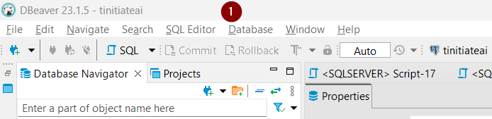
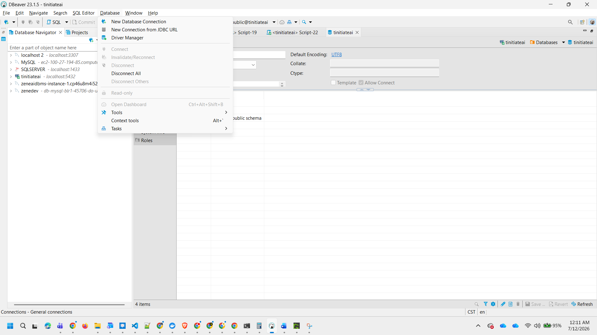
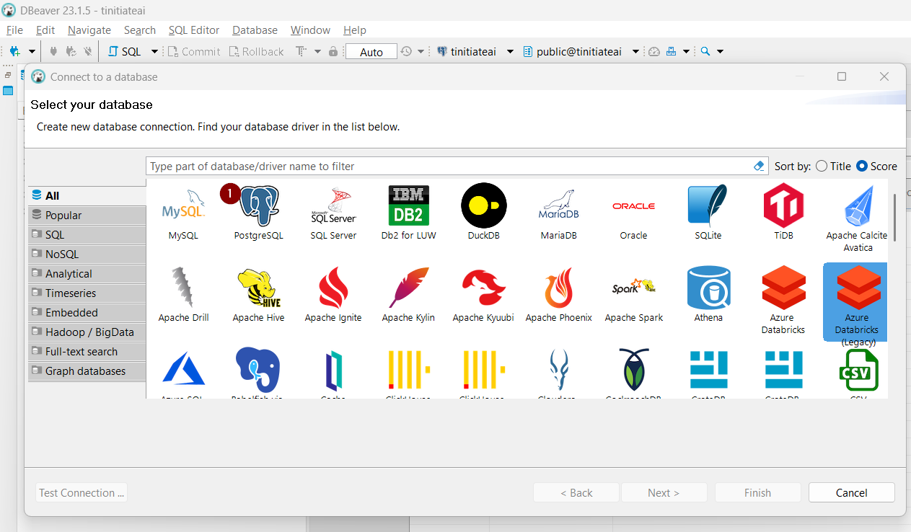
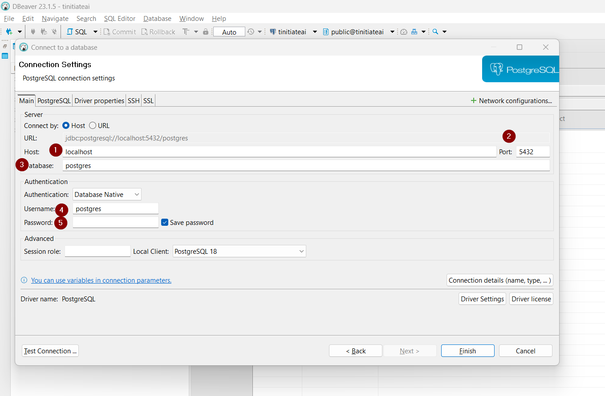

# PySpark Local Setup

Use this page to run PySpark locally with Docker.

This setup uses the same Docker stack used in the PySpark to PostgreSQL lab.

It starts:

- PostgreSQL
- MinIO
- PySpark / Jupyter
- Spark master and worker

## STEP 1: Install Docker Desktop

Download Docker Desktop for Windows:

<https://www.docker.com/products/docker-desktop/>

Install Docker Desktop, start it, and wait until Docker says it is running.

Check Docker:

```cmd
docker version
docker ps
```

If Docker is installed correctly, these commands should run without errors.

## STEP 2: Download and extract the files

Students need two things on their computer:

1. this PySpark repository, which has the scripts and markdown guides;
2. the prepared data ZIP, which has the source files to upload into MinIO.

### 2.1 Download this PySpark repository

Download or clone this repository:

<https://github.com/tinitiateprime/tinitiate-pyspark>

Extract or clone the repository into:

```text
C:\Code\tinitiate_pyspark
```

After extraction, the project folder should look like this:

```text
C:\
  Code
    tinitiate_pyspark
      README.md
      pyspark-basics
      pyspark-database
      pyspark-datalake
```

Important: do not keep the files inside an extra nested folder like this:

```text
C:\Code\tinitiate_pyspark\tinitiate-pyspark
```

If that happens, move the inner files up one level so `README.md` and `pyspark-database` are directly inside:

```text
C:\Code\tinitiate_pyspark
```

### 2.2 Download the prepared data files

Go to the data appliance README:

<https://github.com/tinitiateprime/data-appliance/blob/main/README.md>

Download the prepared data ZIP file provided there.

That ZIP is for data files. It may not contain markdown files such as `MINIO_TO_POSTGRES_SCENARIOS.md`.

Extract or copy the prepared data into this folder inside the PySpark project:

```text
C:\Code\tinitiate_pyspark\data\database_scenarios
```

After extracting the data, the folder should look like this:

```text
C:\
  Code
    tinitiate_pyspark
      data
        database_scenarios
          DDL
            ddl.sql
          01_many_small_json_customer
          02_many_small_json_multiple_tables
          03_many_large_json_sales
          04_many_small_csv_emp
          05_many_small_csv_multiple_tables
          06_many_large_csv_emp
          07_many_small_parquet_transaction
          08_many_small_parquet_multiple_tables
          09_many_large_parquet_sales
          10_ultra_one_million_files
```

### 2.3 Verify the folders

Open Command Prompt and move into the project folder:

```cmd
cd C:\Code\tinitiate_pyspark
```

Check the project folder:

```cmd
dir
```

You should see:

```text
README.md
pyspark-basics
pyspark-database
data
```

Then check the prepared data folder:

```cmd
dir data\database_scenarios
```

You should see scenario folders such as:

```text
01_many_small_json_customer
02_many_small_json_multiple_tables
...
10_ultra_one_million_files
```

This folder is the repository root. Run the remaining commands from this location.

## STEP 3: Start the Docker stack

Run:

```cmd
docker compose -f pyspark-database/ti-data-engineering-docker-compose.yml up -d
```

This starts the containers needed for the lab.

For the beginner labs, focus on these:

| Service | Container | URL or port |
|---|---|---|
| PostgreSQL | `ti-batch-postgres` | `localhost:5432` |
| MinIO | `ti-batch-minio` | API: `localhost:9000`, browser: `http://localhost:9001` |
| Jupyter | `ti-batch-jupyter` | `http://localhost:8888` |

The Docker setup mounts this project folder into the Jupyter container at:

```text
/home/jovyan/work
```

So this Windows project file:

```text
C:\Code\tinitiate_pyspark\pyspark-database\scripts\postgres.py
```

is available inside Docker as:

```text
/home/jovyan/work/pyspark-database/scripts/postgres.py
```

Check containers:

```cmd
docker ps
```

You should see containers such as:

```text
ti-batch-postgres
ti-batch-minio
ti-batch-jupyter
ti-batch-spark-master
ti-batch-spark-worker
```

Verify that the project files are visible inside the Jupyter container:

```cmd
docker exec ti-batch-jupyter ls /home/jovyan/work
```

You should see folders such as:

```text
pyspark-basics
pyspark-database
pyspark-datalake
```

If `/home/jovyan/work` is empty, the container was created with an old folder mount. Recreate the Docker stack:

```cmd
docker compose -f pyspark-database/ti-data-engineering-docker-compose.yml up -d --force-recreate
```

If Docker shows a container name conflict such as:

```text
The container name "/ti-batch-minio" is already in use
```

it means an old container with that name already exists. Remove only the old containers, then start again:

```cmd
docker rm -f ti-batch-minio ti-batch-spark-master ti-batch-spark-worker ti-batch-jupyter ti-batch-postgres
docker compose -f pyspark-database/ti-data-engineering-docker-compose.yml up -d
```

This removes containers only. It does not delete Docker volumes unless `docker volume rm` or `docker compose down -v` is used.

Then check again:

```cmd
docker exec ti-batch-jupyter ls /home/jovyan/work
```

## STEP 4: Create PostgreSQL training tables

PostgreSQL is running now, but the lab tables are not created yet.

Run this command to create the tables:

```cmd
docker exec -e PGPASSWORD=tiuser!23456 ti-batch-postgres psql -v ON_ERROR_STOP=1 -U ti_dbuser -d tinitiateai -f /docker-entrypoint-initdb.d/01_schema.sql
```

Verify the training tables:

```cmd
docker exec -e PGPASSWORD=tiuser!23456 ti-batch-postgres psql -U ti_dbuser -d tinitiateai -c "\dt training.*"
```

You should see tables such as:

```text
training.customer
training.sales
training.emp
training.sales_transaction
training.load_audit
```

## STEP 5: Install DBeaver and connect to PostgreSQL

DBeaver is a database tool. Students can use it to see PostgreSQL schemas, tables, and loaded data.

Download DBeaver Community Edition for Windows:

<https://dbeaver.io/download/>

Install DBeaver, open it, and create a PostgreSQL connection.


click 1 ( database)



then click on New Database connection



Now Click on PostgresSQL



``` 
 Use these connection details:

 
Database type: PostgreSQL
Host: localhost
Port: 5432
Database: tinitiateai
Username: ti_dbuser
Password: tiuser!23456

```
 


 
After connecting, expand:

```text
tinitiateai
  Schemas
    training
      Tables
```

## STEP 6: Install Python packages

Install the Python packages used by the MinIO and PySpark labs:

```cmd
python -m pip install --user minio pyspark==3.5.3
```

If `python` already points to Python 3, this also works:

```cmd
python -m pip install --user minio pyspark==3.5.3
```

After installing PySpark, close and reopen Command Prompt if `spark-submit` is not recognized.

## STEP 7: Open Jupyter Notebook

Make sure the Jupyter container is running:

```cmd
docker ps
```

Get the Jupyter URL:

```cmd
docker logs ti-batch-jupyter
```

Look for a URL like this:

```text
http://127.0.0.1:8888/lab?token=...
```

Copy that URL and paste it into your browser.

If the URL asks for a token, use the token from the Docker logs.

## STEP 8: Access local notebooks and files

The Jupyter container opens inside the Docker environment.

Use it to run the PySpark notebooks from this repository.

Common folders:

```text
pyspark-basics
pyspark-notebooks
pyspark-database
pyspark-datalake
```

## STEP 09: MinIO access

Open MinIO in the browser:

```text
http://localhost:9001
```

Login:

```text
Username: minio
Password: minio123
```

The lab bucket is:

```text
datalake
```

## STEP 10: PySpark to PostgreSQL lab

After Docker, PostgreSQL, MinIO, and Jupyter are running, continue here:

[`../../pyspark-database/MINIO_TO_POSTGRES_SCENARIOS.md`](../../pyspark-database/MINIO_TO_POSTGRES_SCENARIOS.md)

That guide explains how to:

1. upload source files to MinIO;
2. load CSV, JSON, or Parquet files from MinIO into PostgreSQL using PySpark;
3. validate loaded data in PostgreSQL.
