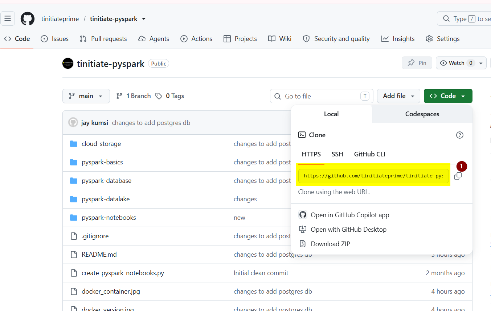
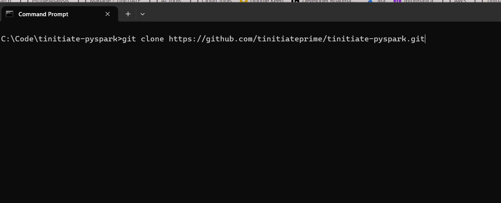

# Download and Extract the Lab Files

Use this page before starting the MinIO to PostgreSQL lab.

Students need two things on their computer:

1. this PySpark repository, which has the scripts and markdown guides;
2. the prepared data ZIP, which has the source files to upload into MinIO.

## 1. Download this PySpark repository

Download or clone this repository:

<https://github.com/tinitiateprime/tinitiate-pyspark>



Click on 1 to copy the link and paste it in the cmd .

This will clone the github repository to your local drive.

```text
C:\tinitiate_pyspark
```

After extraction, the project folder should look like this:

```text
C:\
  tinitiate_pyspark
    README.md
    pyspark-database
      MINIO_TO_POSTGRES_SCENARIOS.md
      scripts
      scenarios
      sql
```

Important: do not keep the files inside an extra nested folder like this:

```text
C:\tinitiate_pyspark\tinitiate-pyspark
```

If that happens, move the inner files up one level so `README.md` and `pyspark-database` are directly inside:

```text
C:\tinitiate_pyspark
```

## 2. Download the prepared data files

Go to the data appliance README:

<https://github.com/tinitiateprime/data-appliance/blob/main/README.md>

Download the prepared ZIP file provided there.

That ZIP is for data files. It may not contain markdown files such as `MINIO_TO_POSTGRES_SCENARIOS.md`.

Extract or copy the prepared data into this folder inside the PySpark project:

```text
C:\tinitiate_pyspark\data\database_scenarios
```

After extracting the data, the folder should look like this:

```text
C:\
  tinitiate_pyspark
    data
      database_scenarios
        DDL
          ddl.sql
        01_many_small_json_customer
        02_many_small_json_multiple_tables
        03_many_large_json_sales
        04_many_small_csv_emp
        05_many_small_csv_multiple_tables
        06_many_large_csv_emp
        07_many_small_parquet_transaction
        08_many_small_parquet_multiple_tables
        09_many_large_parquet_sales
        10_ultra_one_million_files
```

## 3. Verify the folders

Open Command Prompt and run:

```cmd
cd C:\tinitiate_pyspark
dir
```

You should see:

```text
README.md
pyspark-database
data
```

Then check the prepared data folder:

```cmd
dir data\database_scenarios
```

You should see scenario folders such as:

```text
01_many_small_json_customer
02_many_small_json_multiple_tables
...
10_ultra_one_million_files
```

Now return to the main lab guide:

[`MINIO_TO_POSTGRES_SCENARIOS.md`](MINIO_TO_POSTGRES_SCENARIOS.md)
