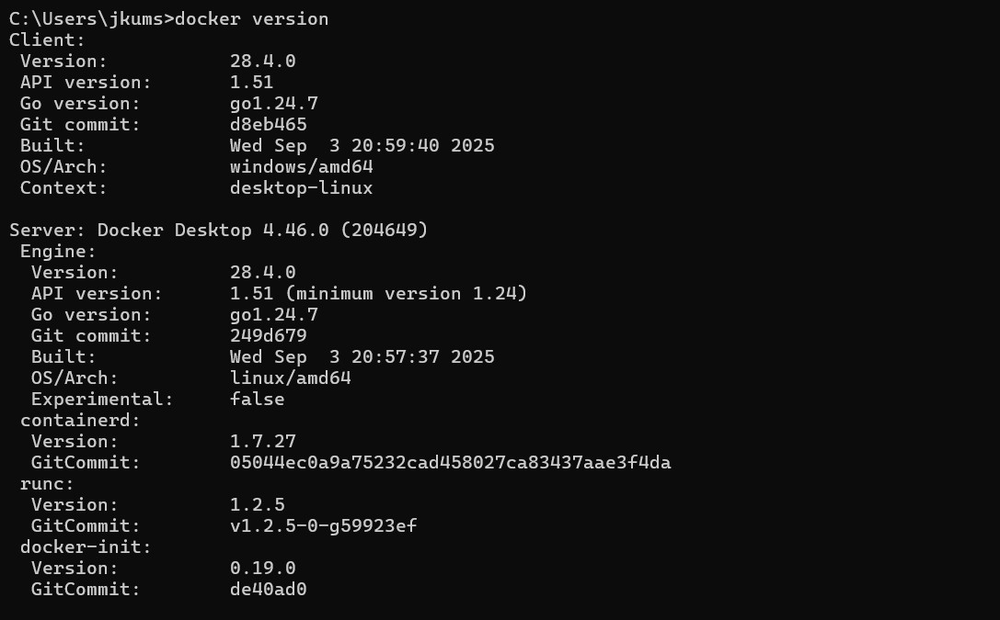
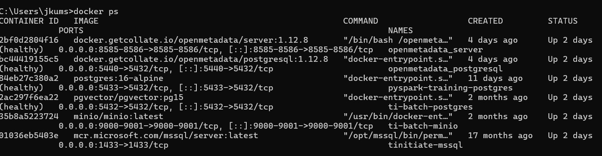

# MinIO Source Files to PostgreSQL — Student Guide

This document is a complete beginner guide for the MinIO to PostgreSQL PySpark lab.

In this lab, students will download the lab files, start PostgreSQL and MinIO using Docker, create the PostgreSQL tables, upload the prepared files into MinIO, and then load the MinIO files into PostgreSQL using PySpark.

The goal is to practice a real data engineering flow:

```text
CSV / JSON / Parquet files -> MinIO bucket -> PySpark -> PostgreSQL tables
```

Simple lab flow:

1. Download and extract the lab files into `C:\tinitiate_pyspark`.
2. Start Docker containers for PostgreSQL and MinIO.
3. Run the PostgreSQL DDL script to create tables.
4. Connect to PostgreSQL using DBeaver and view the tables.
5. Upload the prepared data files into MinIO.
6. Run the PySpark load script to move data from MinIO into PostgreSQL.
7. Check the loaded rows in PostgreSQL.

This lab uses:

- PostgreSQL database `tinitiateai`
- PostgreSQL user `ti_dbuser`
- MinIO bucket `datalake`

Before running commands, students must download and extract the project files.

Students can get the project files in either of these ways:

- go to the GitHub README and download the ZIP file: <https://github.com/tinitiateprime/data-appliance/blob/main/README.md>
- follow the local download and extract guide: [`DOWNLOAD_AND_EXTRACT_PROJECT.md`](DOWNLOAD_AND_EXTRACT_PROJECT.md)

After extracting the project, open Command Prompt and move into the project folder:

```cmd
cd C:\tinitiate_pyspark
```

This folder is called the repository root. All commands in this guide should be run from this location.

## Source files for the lab

The recommended approach is to download the prepared ZIP files from GitHub and extract them into the project folder.

If students want to generate the source files locally instead of using the GitHub files, use this optional guide:

[`GENERATE_FILES_LOCALLY.md`](GENERATE_FILES_LOCALLY.md)

## Step 1: Install Docker Desktop

Download Docker Desktop for Windows:

<https://www.docker.com/products/docker-desktop/>

Install it, start Docker Desktop, and wait until Docker says it is running.

Check Docker:

To check the Docker version, run:

```cmd
docker version
```




```cmd
docker ps
```



`docker ps` shows running containers. If Docker is working but no containers are running yet, the list may be empty.

## Step 2: Start the Docker stack

Use this Docker compose file:

[`pyspark-database/ti-data-engineering-docker-compose.yml`](ti-data-engineering-docker-compose.yml)

Run:

```cmd
docker compose -f pyspark-database/ti-data-engineering-docker-compose.yml up -d
```

For this lab, students mainly need these two services:

| Service | Container | URL or port |
|---|---|---|
| PostgreSQL | `postgres` | `localhost:5432` |
| MinIO | `minio` | API: `localhost:9000`, browser: `http://localhost:9001` |

The Docker compose file may start other support containers also. For this lab, focus on `postgres` and `minio`.

Check containers:

```cmd
docker ps
```


For this lab, these two containers must be running:

```text
postgres
minio
```

## Step 3: Create PostgreSQL tables

PostgreSQL is running now, but the lab tables are not created yet.

Run this command to create the tables inside PostgreSQL:

```cmd
docker exec -e PGPASSWORD=tiuser!23456 postgres psql -v ON_ERROR_STOP=1 -U ti_dbuser -d tinitiateai -f /lab/sql/01_schema.sql
```

This runs the DDL file [`pyspark-database/sql/01_schema.sql`](sql/01_schema.sql) inside the Docker PostgreSQL container.

Verify the training tables:

```cmd
docker exec -e PGPASSWORD=tiuser!23456 postgres psql -U ti_dbuser -d tinitiateai -c "\dt training.*"
```

You should see tables such as:

```text
training.customer
training.sales
training.emp
training.sales_transaction
training.load_audit
```

PostgreSQL details:

```text
Host: localhost
Port: 5432
Database: tinitiateai
User: ti_dbuser
Password: tiuser!23456
Schema: training
```

Note: `PGPASSWORD` is only used for this command. It passes the PostgreSQL password to Docker while the command runs.

At this point, PostgreSQL has empty training tables. The data itself is loaded later from MinIO into PostgreSQL by PySpark.

## Step 4: Install DBeaver and connect to PostgreSQL

DBeaver is a database tool. Students can use it to see the PostgreSQL database, schemas, tables, and loaded data.

Download DBeaver Community Edition for Windows:

<https://dbeaver.io/download/>

Install DBeaver, open it, and create a PostgreSQL connection.

Use these connection details:

```text
Database type: PostgreSQL
Host: localhost
Port: 5432
Database: tinitiateai
Username: ti_dbuser
Password: tiuser!23456
```

When DBeaver asks to download the PostgreSQL driver, click `Download`.

After connecting, expand:

```text
tinitiateai
  Schemas
    training
      Tables
```

Students should see tables such as:

```text
customer
dept
emp
location
product
projects
sales
sales_transaction
load_audit
```

At this point the tables may be empty. The data will appear after the PySpark load step.

## Step 5: Install Python packages

Install the Python packages used by this lab:

- `minio`, to upload files into MinIO;
- `pyspark`, to run the PySpark load script.

Run:

```cmd
C:\Python311\python.exe -m pip install --user minio pyspark==3.5.3
```

If `python` already points to Python 3, this also works:

```cmd
python -m pip install --user minio pyspark==3.5.3
```

After installing PySpark, close and reopen Command Prompt if `spark-submit` is not recognized.

## Step 6: Upload the GitHub files to MinIO

If students downloaded and extracted the prepared files from GitHub, the files should already exist under:

```text
data/database_scenarios
```

To upload those existing files to MinIO without generating them again, run:

```cmd
C:\Python311\python.exe pyspark-database/scripts/publish_minio_lab.py --skip-generate
```

Or:

```cmd
python pyspark-database/scripts/publish_minio_lab.py --skip-generate
```

What happens:

1. The script uses the existing files under `data/database_scenarios`.
2. DDL is staged at `data/database_scenarios/DDL/ddl.sql`.
3. The script connects to MinIO:

```text
Endpoint: http://localhost:9000
User: minio
Password: minio123
Bucket: datalake
```

4. The DDL and scenario folders are uploaded to MinIO.

If students want to generate the files locally instead of using the GitHub ZIP files, follow this optional guide:

[`GENERATE_FILES_LOCALLY.md`](GENERATE_FILES_LOCALLY.md)

## Step 7: Check files in MinIO

Open:

```text
http://localhost:9001
```

Login:

```text
Username: minio
Password: minio123
```

Open bucket:

```text
datalake
```

You should see:

```text
DDL
01_many_small_json_customer
02_many_small_json_multiple_tables
...
10_ultra_one_million_files
```

Inside each scenario, files are separated by format:

```text
<scenario-folder>
  <dataset-folder>
    csv
    json
    parquet
```

Example:

```text
datalake
  01_many_small_json_customer
    01_json_small_customer
      csv
        customer
      json
        customer
      parquet
        customer
```

## Step 8: Load data from MinIO to PostgreSQL using PySpark

In this step, PySpark reads files from MinIO and writes the rows into PostgreSQL.

Run these variables first in the same Command Prompt window:

```cmd
set POSTGRES_JDBC_URL=jdbc:postgresql://localhost:5432/tinitiateai
set POSTGRES_USER=ti_dbuser
set POSTGRES_PASSWORD=tiuser!23456

set MINIO_ENDPOINT=http://localhost:9000
set MINIO_ACCESS_KEY=minio
set MINIO_SECRET_KEY=minio123
set MINIO_BUCKET=datalake

set PACKAGES=org.postgresql:postgresql:42.7.4,org.apache.hadoop:hadoop-aws:3.3.4
```

These values tell PySpark:

- where PostgreSQL is running;
- which PostgreSQL user and password to use;
- where MinIO is running;
- which extra Spark packages are needed to read from MinIO and write to PostgreSQL.

### Option A: Load all MinIO scenario folders for one format

Use this option when you want PySpark to load multiple scenario folders from MinIO into PostgreSQL.

Load all CSV folders:

```cmd
spark-submit --packages %PACKAGES% ^
  pyspark-database/scripts/load_minio_scenarios_to_postgres.py ^
  --source-format csv ^
  --scenarios all ^
  --write-mode overwrite
```

To load JSON instead of CSV:

```cmd
spark-submit --packages %PACKAGES% ^
  pyspark-database/scripts/load_minio_scenarios_to_postgres.py ^
  --source-format json ^
  --scenarios all ^
  --write-mode overwrite
```

To load Parquet instead of CSV:

```cmd
spark-submit --packages %PACKAGES% ^
  pyspark-database/scripts/load_minio_scenarios_to_postgres.py ^
  --source-format parquet ^
  --scenarios all ^
  --write-mode overwrite
```

What this script does:

1. Looks at the scenario list in the script.
2. Builds each MinIO path automatically.
3. Reads the selected format: CSV, JSON, or Parquet.
4. Loads each folder into the matching PostgreSQL table.
5. Writes audit records into `training.load_audit`.

Important: load one format at a time. CSV, JSON, and Parquet contain the same logical data. Loading all three formats together can duplicate data.

The default `--write-mode overwrite` makes the lab easy to rerun. Some scenarios load into the same target table, such as `customer` or `sales`, so overwrite avoids duplicate primary-key errors.

To load only selected scenarios, pass the scenario numbers:

```cmd
spark-submit --packages %PACKAGES% ^
  pyspark-database/scripts/load_minio_scenarios_to_postgres.py ^
  --source-format csv ^
  --scenarios 01,02,05 ^
  --write-mode overwrite
```

### Option B: Beginner example: load only Scenario 01 customer CSV files

This example loads the CSV version of Scenario 01 from MinIO into PostgreSQL table `training.customer`.

Before starting this example, make sure students already ran:

```cmd
C:\Python311\python.exe pyspark-database/scripts/publish_minio_lab.py --skip-generate
```

JSON and Parquet work the same way; only the format folder and `--source-format` value change.

### 1. Confirm Scenario 01 exists in MinIO

In the MinIO browser at `http://localhost:9001`, open:

```text
datalake
  01_many_small_json_customer
    01_json_small_customer
      csv
      json
      parquet
```

The Spark path for the CSV customer files is:

```text
s3a://datalake/01_many_small_json_customer/01_json_small_customer/csv/customer
```

### 2. Load the CSV files from MinIO into PostgreSQL

```cmd
spark-submit --packages %PACKAGES% ^
  pyspark-database/scripts/load_files_to_postgres.py ^
  --source-path s3a://datalake/01_many_small_json_customer/01_json_small_customer/csv/customer ^
  --source-format csv ^
  --target-table customer ^
  --scenario scenario-01-minio-csv-customer ^
  --write-mode overwrite ^
  --expected-files 20 ^
  --write-partitions 4
```

Important: the `--source-path` starts with `s3a://datalake/...`. That means Spark reads from MinIO, not from the local generated folder.

What this PySpark command does:

1. Reads customer CSV files from MinIO.
2. Validates and converts the columns.
3. Writes good rows into PostgreSQL table `training.customer`.
4. Writes a load audit record into `training.load_audit`.

### 3. Validate the PostgreSQL table

In DBeaver, open a SQL Editor for the `tinitiateai` connection and run:

```sql
SELECT COUNT(*) FROM training.customer;
```

Or run the same check from Command Prompt:

```cmd
docker exec -e PGPASSWORD=tiuser!23456 postgres psql -U ti_dbuser -d tinitiateai -c "SELECT COUNT(*) FROM training.customer;"
```

Expected count:

```text
200
```

### 4. Validate the audit record

In DBeaver SQL Editor, run:

```sql
SELECT scenario, target_table, source_format, source_path, accepted_rows, rejected_rows
FROM training.load_audit
ORDER BY load_id DESC
LIMIT 5;
```

Or run it from Command Prompt:

```cmd
docker exec -e PGPASSWORD=tiuser!23456 postgres psql -U ti_dbuser -d tinitiateai -c "SELECT scenario, target_table, source_format, source_path, accepted_rows, rejected_rows FROM training.load_audit ORDER BY load_id DESC LIMIT 5;"
```

The `source_path` should begin with:

```text
s3a://datalake/
```

## Loading another format

To load JSON instead of CSV, change:

```text
csv/customer
--source-format csv
```

to:

```text
json/customer
--source-format json
```

To load Parquet, change it to:

```text
parquet/customer
--source-format parquet
```

Load only one format at a time. CSV, JSON, and Parquet contain the same logical rows, so loading all three into the same table will duplicate data unless you overwrite or clean the table first.

## Scenario path reference

Use these MinIO paths when building `--source-path`.

| Scenario | Table(s) | MinIO path pattern |
|---|---|---|
| 01 | `customer` | `s3a://datalake/01_many_small_json_customer/01_json_small_customer/<format>/customer` |
| 02 | `location`, `product`, `customer`, `sales` | `s3a://datalake/02_many_small_json_multiple_tables/02_json_small_multi/<format>/<table>` |
| 03 | `sales` | `s3a://datalake/03_many_large_json_sales/03_json_large_sales/<format>/sales` |
| 04 | `emp` | `s3a://datalake/04_many_small_csv_emp/04_csv_small_emp/<format>/emp` |
| 05 | `dept`, `projects`, `emp`, `emp_projects` | `s3a://datalake/05_many_small_csv_multiple_tables/05_csv_small_multi/<format>/<table>` |
| 06 | `emp` | `s3a://datalake/06_many_large_csv_emp/06_csv_large_emp/<format>/emp` |
| 07 | `sales_transaction` | `s3a://datalake/07_many_small_parquet_transaction/07_parquet_small_sales_transaction/<format>/sales_transaction` |
| 08 | `location`, `product`, `customer`, `sales` | `s3a://datalake/08_many_small_parquet_multiple_tables/08_parquet_small_multi/<format>/<table>` |
| 09 | `sales` | `s3a://datalake/09_many_large_parquet_sales/09_parquet_large_sales/<format>/sales` |
| 10 | `sales_transaction` | `s3a://datalake/10_ultra_one_million_files/10_ultra_sales_transaction/<format>/sales_transaction` |
| 11 | `sales_transaction`, CDC changes | `s3a://datalake/11_millions_updates_deletes/...` |

Use one of these values for `<format>`:

```text
csv
json
parquet
```

## Useful checks

Show PostgreSQL tables:

```cmd
docker exec -e PGPASSWORD=tiuser!23456 postgres psql -U ti_dbuser -d tinitiateai -c "\dt training.*"
```

Show recent loads:

```cmd
docker exec -e PGPASSWORD=tiuser!23456 postgres psql -U ti_dbuser -d tinitiateai -c "SELECT target_table, scenario, source_format, source_path, accepted_rows, rejected_rows FROM training.load_audit ORDER BY load_id DESC LIMIT 10;"
```

Show row count for one table:

```cmd
docker exec -e PGPASSWORD=tiuser!23456 postgres psql -U ti_dbuser -d tinitiateai -c "SELECT COUNT(*) FROM training.customer;"
```

## If you need to republish

Re-running [`publish_minio_lab.py`](scripts/publish_minio_lab.py) uploads the files again and replaces objects with the same names.

```cmd
C:\Python311\python.exe pyspark-database/scripts/publish_minio_lab.py --skip-generate
```

If old folders were created with different names, delete them from the MinIO console before republishing.
