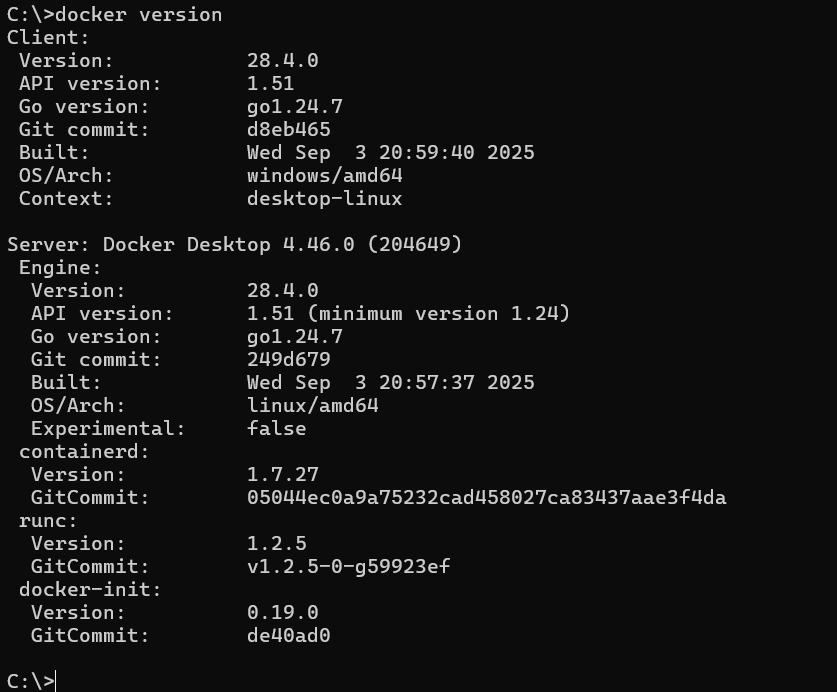

# Old MinIO Source Files to PostgreSQL — Step-by-Step Scenarios

This lab separates every exercise into three visible stages:

1. A scenario-specific Python script generates the same records as CSV, newline-delimited JSON, and Parquet files locally.
2. A reusable Python script uploads those exact files to MinIO.
3. PySpark reads the files from their published `s3a://` location, validates them, and writes accepted rows to PostgreSQL through JDBC.

Run commands from the repository root.

## One-time setup for new students

These steps use the same Docker environment shown in the instructor machine:

| Service | Container name | Image | Host URL or port | Purpose |
|---|---|---|---|---|
| PostgreSQL | `postgres` | `pgvector/pgvector:pg15` | `localhost:5432` | Target database where PySpark writes rows |
| MinIO | `minio` | `minio/minio` | API `localhost:9000`, console `localhost:9001` | Object storage where generated CSV, JSON, and Parquet files are published |
| Jupyter | `jupyter` | `jupyter/pyspark-notebook:latest` | `localhost:8888` | Optional notebook environment |
| Spark | `spark-master`, `spark-worker` | `bde2020/spark-*` | master `7077`, UIs `8088`/`8089` | Optional Spark cluster services |

The scripts in this lab now default to these values:

```text
PostgreSQL JDBC URL: jdbc:postgresql://localhost:5432/metastore
PostgreSQL user:     admin
PostgreSQL password: admin
MinIO endpoint:      http://localhost:9000
MinIO user:          minio
MinIO password:      minio123
MinIO bucket:        datalake
```

If your instructor already started the `postgres` and `minio` containers, do not recreate them. Go directly to Step 4 and verify they are running.

### Step 1: Install Docker Desktop

1. Download and install Docker Desktop for Windows from the official Docker website: <https://www.docker.com/products/docker-desktop/>
2. Start Docker Desktop.
3. Wait until Docker shows that the engine is running.
4. Open Command Prompt, Windows Terminal, or any terminal from the repository root.
5. Confirm Docker works:

```cmd
open cmd prompt and enter docker version

docker ps
```

If `docker ps` fails, Docker Desktop is not ready yet or the current Windows user does not have Docker permission.

### Step 2: Start the full data engineering Docker stack

For a fresh student machine, run:

```cmd
docker compose -f pyspark-database/ti-data-engineering-docker-compose.yml up -d
```

This creates:

- `postgres` on port `5432`
- `minio` on ports `9000` and `9001`
- `spark-master`, `spark-worker`, and `jupyter`
- Kafka, Kafka UI, and Airflow services

Check status:

```cmd
docker ps
```

At minimum, for this lab, these containers must be running:

```text
postgres
minio
```

### Step 3: Open MinIO in the browser only

Open:

```text
http://localhost:9001
```

Login:

```text
Username: minio
Password: minio123
```

At this point, MinIO may still be empty. That is okay. Step 3 is only to confirm that the MinIO console opens and the login works.

Later, after students run the publishing process, [`pyspark-database/scripts/publish_minio_lab.py`](scripts/publish_minio_lab.py) creates the `datalake` bucket automatically if it does not exist, uploads `DDL/ddl.sql`, and uploads every generated scenario folder.

After the upload step, students should see objects under:

```text
datalake/
  DDL/
    ddl.sql
  01_many_small_json_customer/
  02_many_small_json_multiple_tables/
  ...
```

### Step 4: Verify PostgreSQL and create the schema if needed

The Docker compose file starts PostgreSQL, but the training tables are created by this lab's DDL file.

Apply the DDL manually from the repository:

```cmd
type pyspark-database\sql\01_schema.sql | docker exec -i -e PGPASSWORD=admin postgres psql -U admin -d metastore
```

Verify the training tables:

```cmd
docker exec -e PGPASSWORD=admin postgres psql -U admin -d metastore -c "\dt training.*"
```

You should see tables such as:

```text
training.customer
training.sales
training.emp
training.sales_transaction
training.load_audit
```

### Step 5: Install Python packages

For the MinIO publishing process, students need the MinIO Python SDK and PyArrow. PyArrow is required because the generators create Parquet files:

```cmd
C:\Python311\python.exe -m pip install --user minio pyarrow
```

If students also want to run PySpark from the same local Python installation, install the full requirements:

```cmd
C:\Python311\python.exe -m pip install --user -r pyspark-database/requirements.txt
```

Use `--user` on Windows if Python is installed under `C:\Python311`; otherwise pip may fail with a permission error such as `Permission denied: 'C:\Python311\Scripts\beeline'`.

### Step 6: Set environment variables for host terminal runs

Use these values when running scripts from Windows Command Prompt:

```cmd
set POSTGRES_JDBC_URL=jdbc:postgresql://localhost:5432/metastore
set POSTGRES_USER=admin
set POSTGRES_PASSWORD=admin

set MINIO_ENDPOINT=http://localhost:9000
set MINIO_ACCESS_KEY=minio
set MINIO_SECRET_KEY=minio123
set MINIO_BUCKET=datalake
```

Spark needs both the PostgreSQL JDBC driver and the S3A connector:

```cmd
set PACKAGES=org.postgresql:postgresql:42.7.4,org.apache.hadoop:hadoop-aws:3.3.4
```

These package coordinates match Spark 3.5.x with Hadoop 3.3.x. If Spark reports a Hadoop version mismatch, run `spark-submit --version` and select the matching `hadoop-aws` version.

### Step 7: If running Spark inside a Docker/Jupyter container

When Spark runs inside the `jupyter` container from this compose file, do not use `localhost` for PostgreSQL or MinIO. Inside a container, `localhost` means that container itself.

Use container names instead:

```cmd
set POSTGRES_JDBC_URL=jdbc:postgresql://postgres:5432/metastore
set MINIO_ENDPOINT=http://minio:9000
```

The remaining values stay the same:

```cmd
set POSTGRES_USER=admin
set POSTGRES_PASSWORD=admin
set MINIO_ACCESS_KEY=minio
set MINIO_SECRET_KEY=minio123
set MINIO_BUCKET=datalake
```

## Required workflow for every scenario

Always follow this order:

1. Publish the lab files to MinIO with [`publish_minio_lab.py`](scripts/publish_minio_lab.py). This generates the source files and uploads `DDL/ddl.sql` plus scenario folders.
2. Apply the DDL to PostgreSQL from `pyspark-database/sql/01_schema.sql`, or download/use `s3a://datalake/DDL/ddl.sql` if your exercise requires students to pick DDL from MinIO.
3. Load from the `s3a://datalake/...` MinIO path into PostgreSQL with `load_files_to_postgres.py`.
4. Validate the row count in PostgreSQL and check `training.load_audit`.

Do not load from the local `data/database_scenarios/...` folder for this lab. The purpose is to prove PySpark can read from MinIO and write to PostgreSQL.

## Publish all lab files to MinIO

Run this one command to generate scenarios 01-10, stage the DDL as `data/database_scenarios/DDL/ddl.sql`, and upload everything to MinIO:

```cmd
python pyspark-database/scripts/publish_minio_lab.py
```

With the MinIO defaults, this command connects to:

```text
http://localhost:9000
user: minio
password: minio123
bucket: datalake
```

After it finishes, the MinIO browser should look like this:

```text
datalake
  DDL
    ddl.sql
  01_many_small_json_customer
  02_many_small_json_multiple_tables
  03_many_large_json_sales
  04_many_small_csv_emp
  05_many_small_csv_multiple_tables
  06_many_large_csv_emp
  07_many_small_parquet_transaction
  08_many_small_parquet_multiple_tables
  09_many_large_parquet_sales
  10_ultra_one_million_files
```

Every generated dataset has parallel format folders:

```text
<dataset-folder>/csv/<table>/*.csv
<dataset-folder>/json/<table>/*.json
<dataset-folder>/parquet/<table>/*.parquet
```

To compare formats, keep the table and scenario fixed, change the format segment in `--source-path`, and pass the matching value to `--source-format`. Load only one format at a time; otherwise the same logical rows would be inserted three times.

To also include the heavier Scenario 11 folder, run:

```cmd
python pyspark-database/scripts/publish_minio_lab.py --include-heavy
```

Re-running the publisher replaces objects with the same names. It does not remove obsolete objects that have different names; use a fresh bucket or clean old scenario folders before changing file counts.

## Reusable single-scenario upload command

Use this only when you want to regenerate and upload one scenario instead of publishing the full lab:

```cmd
python pyspark-database/scenarios/01_many_small_json_customer/generate_source.py
python pyspark-database/scripts/upload_sources_to_minio.py ^
  --source-dir data/database_scenarios/01_many_small_json_customer ^
  --scenario 01_many_small_json_customer
```

The stable student location is:

```text
s3a://datalake/<scenario-folder>/
```

## Reusable PostgreSQL load command

For scenarios 1–10, substitute the path, format, table, and tuning values shown below:

```cmd
spark-submit --packages %PACKAGES% ^
  pyspark-database/scripts/load_files_to_postgres.py ^
  --source-path <s3a-path> ^
  --source-format <csv|json|parquet> ^
  --target-table <table> ^
  --scenario <audit-name> ^
  --expected-files <count> ^
  --write-partitions <count>
```

With the Docker compose defaults, this writes to:

```text
jdbc:postgresql://localhost:5432/metastore
schema: training
user: admin
```

For multi-table scenarios, run the command once per table in the listed dependency order.

## Complete beginner example — Scenario 01 from MinIO to PostgreSQL

This example uses Scenario 01 and loads the CSV version. JSON and Parquet work the same way; only the format folder and `--source-format` value change.

### 1. Generate the source files

```cmd
python pyspark-database/scenarios/01_many_small_json_customer/generate_source.py
```

This creates local files under:

```text
data/database_scenarios/01_many_small_json_customer/
```

Inside the output, students get all three formats:

```text
01_json_small_customer/csv/customer/*.csv
01_json_small_customer/json/customer/*.json
01_json_small_customer/parquet/customer/*.parquet
```

### 2. Upload those files to MinIO

```cmd
python pyspark-database/scripts/upload_sources_to_minio.py ^
  --source-dir data/database_scenarios/01_many_small_json_customer ^
  --scenario 01_many_small_json_customer
```

After upload, the student location is:

```text
s3a://datalake/01_many_small_json_customer/
```

In the MinIO browser at `http://localhost:9001`, open:

```text
datalake
  01_many_small_json_customer
    01_json_small_customer
      csv
      json
      parquet
```

### 3. Load the CSV files from MinIO into PostgreSQL

```cmd
spark-submit --packages %PACKAGES% ^
  pyspark-database/scripts/load_files_to_postgres.py ^
  --source-path s3a://datalake/01_many_small_json_customer/01_json_small_customer/csv/customer ^
  --source-format csv ^
  --target-table customer ^
  --scenario scenario-01-minio-csv-customer ^
  --expected-files 20 ^
  --write-partitions 4
```

Important: the `--source-path` starts with `s3a://datalake/...`. That means Spark reads from MinIO, not from the local generated folder.

### 4. Validate the PostgreSQL table

```cmd
docker exec -e PGPASSWORD=admin postgres psql -U admin -d metastore -c "SELECT COUNT(*) FROM training.customer;"
```

Expected count:

```text
200
```

Check the audit record:

```cmd
docker exec -e PGPASSWORD=admin postgres psql -U admin -d metastore -c "SELECT scenario, target_table, source_format, source_path, accepted_rows, rejected_rows FROM training.load_audit ORDER BY load_id DESC LIMIT 5;"
```

The `source_path` should begin with:

```text
s3a://datalake/
```

## Scenario 01 — many small customer files in all formats

1. Generate with [Scenario 01 `generate_source.py`](scenarios/01_many_small_json_customer/generate_source.py): `python pyspark-database/scenarios/01_many_small_json_customer/generate_source.py`
2. Upload with scenario folder `01_many_small_json_customer`.
3. Choose CSV, JSON, or Parquet. Load `customer` from `s3a://datalake/01_many_small_json_customer/01_json_small_customer/<format>/customer`, using the same `<format>` for `--source-format`, 20 expected files, 4 writers, and a format-specific audit name such as `scenario-01-minio-csv-customer`.
4. Expected result: 200 accepted customer rows.

## Scenario 02 — many small multi-table files in all formats

1. Generate with [Scenario 02 `generate_source.py`](scenarios/02_many_small_json_multiple_tables/generate_source.py): `python pyspark-database/scenarios/02_many_small_json_multiple_tables/generate_source.py`
2. Upload with scenario folder `02_many_small_json_multiple_tables`.
3. Base path: `s3a://datalake/02_many_small_json_multiple_tables/02_json_small_multi/<format>`.
4. Choose CSV, JSON, or Parquet, then load `location` (2 writers), `product` (2), `customer` (2), and `sales` (4) in that order. Append `/<table>` to the base path and use 20 expected files per call.
5. Expected result: 200 accepted rows per table.

## Scenario 03 — many large sales files in all formats

1. Generate with [Scenario 03 `generate_source.py`](scenarios/03_many_large_json_sales/generate_source.py): `python pyspark-database/scenarios/03_many_large_json_sales/generate_source.py`
2. Upload with scenario folder `03_many_large_json_sales`.
3. Load `sales` from `s3a://datalake/03_many_large_json_sales/03_json_large_sales/<format>/sales` using the selected CSV, JSON, or Parquet format, 2 expected files, 8 writers, and `--batch-size 20000`.
4. Expected result: 200,000 accepted sales rows.

## Scenario 04 — many small employee files in all formats

1. Generate with [Scenario 04 `generate_source.py`](scenarios/04_many_small_csv_emp/generate_source.py): `python pyspark-database/scenarios/04_many_small_csv_emp/generate_source.py`
2. Upload with scenario folder `04_many_small_csv_emp`.
3. Load `emp` from `s3a://datalake/04_many_small_csv_emp/04_csv_small_emp/<format>/emp` using the selected CSV, JSON, or Parquet format, 20 expected files, and 4 writers.
4. Expected result: 200 accepted employee rows.

## Scenario 05 — many small multi-table files in all formats

1. Generate with [Scenario 05 `generate_source.py`](scenarios/05_many_small_csv_multiple_tables/generate_source.py): `python pyspark-database/scenarios/05_many_small_csv_multiple_tables/generate_source.py`
2. Upload with scenario folder `05_many_small_csv_multiple_tables`.
3. Base path: `s3a://datalake/05_many_small_csv_multiple_tables/05_csv_small_multi/<format>`.
4. Choose CSV, JSON, or Parquet, then load `dept` (2 writers), `projects` (2), `emp` (4), and `emp_projects` (4) in that order. Use 20 expected files per call.
5. Expected result: 200 accepted rows per table.

## Scenario 06 — many large employee files in all formats

1. Generate with [Scenario 06 `generate_source.py`](scenarios/06_many_large_csv_emp/generate_source.py): `python pyspark-database/scenarios/06_many_large_csv_emp/generate_source.py`
2. Upload with scenario folder `06_many_large_csv_emp`.
3. Load `emp` from `s3a://datalake/06_many_large_csv_emp/06_csv_large_emp/<format>/emp` using the selected CSV, JSON, or Parquet format, 2 expected files, 8 writers, and `--batch-size 20000`.
4. Expected result: 200,000 accepted employee rows.

## Scenario 07 — many small transaction files in all formats

1. Generate with [Scenario 07 `generate_source.py`](scenarios/07_many_small_parquet_transaction/generate_source.py): `python pyspark-database/scenarios/07_many_small_parquet_transaction/generate_source.py`
2. Upload with scenario folder `07_many_small_parquet_transaction`.
3. Load `sales_transaction` from `s3a://datalake/07_many_small_parquet_transaction/07_parquet_small_sales_transaction/<format>/sales_transaction` using the selected CSV, JSON, or Parquet format, 20 expected files, and 4 writers.
4. Expected result: 200 accepted transaction rows.

## Scenario 08 — many small multi-table files in all formats

1. Generate with [Scenario 08 `generate_source.py`](scenarios/08_many_small_parquet_multiple_tables/generate_source.py): `python pyspark-database/scenarios/08_many_small_parquet_multiple_tables/generate_source.py`
2. Upload with scenario folder `08_many_small_parquet_multiple_tables`.
3. Base path: `s3a://datalake/08_many_small_parquet_multiple_tables/08_parquet_small_multi/<format>`.
4. Choose CSV, JSON, or Parquet, then load `location` (2 writers), `product` (2), `customer` (2), and `sales` (4) in that order. Use 20 expected files per call.
5. Expected result: 200 accepted rows per table.

## Scenario 09 — many large sales files in all formats

1. Generate with [Scenario 09 `generate_source.py`](scenarios/09_many_large_parquet_sales/generate_source.py): `python pyspark-database/scenarios/09_many_large_parquet_sales/generate_source.py`
2. Upload with scenario folder `09_many_large_parquet_sales`.
3. Load `sales` from `s3a://datalake/09_many_large_parquet_sales/09_parquet_large_sales/<format>/sales` using the selected CSV, JSON, or Parquet format, 2 expected files, 8 writers, and `--batch-size 20000`.
4. Expected result: 200,000 accepted sales rows.

## Scenario 10 — ultra file-count exercise

1. Generate the safe teaching default with [Scenario 10 `generate_source.py`](scenarios/10_ultra_one_million_files/generate_source.py): `python pyspark-database/scenarios/10_ultra_one_million_files/generate_source.py`.
2. Upload with scenario folder `10_ultra_one_million_files`. This uploads 10,000 objects for each format and intentionally exposes object-listing overhead.
3. Load `sales_transaction` from `s3a://datalake/10_ultra_one_million_files/10_ultra_sales_transaction/<format>/sales_transaction` using the selected CSV, JSON, or Parquet format, 10,000 expected files, and 4 writers.
4. Expected result: 10,000 accepted rows. The Python default is deliberately not one million files; modify the generator only after reviewing storage, request, runtime, and cleanup costs.

## Scenario 11 — updates and deletes through CDC staging

1. Generate with [Scenario 11 `generate_source.py`](scenarios/11_millions_updates_deletes/generate_source.py): `python pyspark-database/scenarios/11_millions_updates_deletes/generate_source.py`.
2. Upload with scenario folder `11_millions_updates_deletes`.
3. Choose a base format and load it with `load_files_to_postgres.py`: source `s3a://datalake/11_millions_updates_deletes/10_ultra_sales_transaction/<format>/sales_transaction`, matching source format, target `sales_transaction`, 2 expected files, 4 writers, audit name such as `scenario-11-minio-parquet-base`, and `--write-mode overwrite`.
4. Apply changes in the same or another selected format. This example uses Parquet:

```cmd
spark-submit --packages %PACKAGES% ^
  pyspark-database/scripts/apply_sales_transaction_cdc.py ^
  --source-path s3a://datalake/11_millions_updates_deletes/11_cdc_sales_transaction/parquet/sales_transaction_changes ^
  --source-format parquet ^
  --write-partitions 4
```

5. Expected result: 100,000 updates, 10,000 deletes, and 190,000 remaining target rows. The same prefix also contains equivalent CSV and JSON change sets for format comparison.

## Validate every load

Open PostgreSQL and compare the target counts with the expected values above:

```sql
SELECT target_table, scenario, source_path, source_files,
       accepted_rows, rejected_rows, read_seconds, write_seconds
FROM training.load_audit
ORDER BY load_id DESC;
```

For one target table:

```sql
SELECT COUNT(*) FROM training.customer;
```

The `source_path` in `training.load_audit` should begin with `s3a://datalake/`. That proves the Spark job read the student files from MinIO rather than from the local generation folder.
